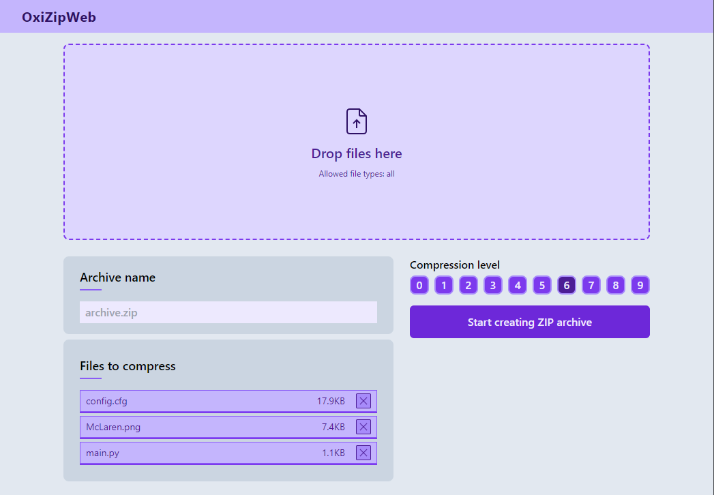

# OxiZipWeb
Zip archiver for web made using Preact and TypeScript.

## Description
OxiZipWeb is a file archiver web application. Program allows you to create ZIP archives. Made using Preact library and TypeScript.

## [Live website](https://karolstawowski.github.io/OxiZipWeb/)

## Tools and technologies

- <a href="https://preactjs.com/" target="_blank">Preact</a>
- TypeScript
- <a href="https://www.npmjs.com/package/fflate" target="_blank">fflate</a>
- Tailwind
- Vite
